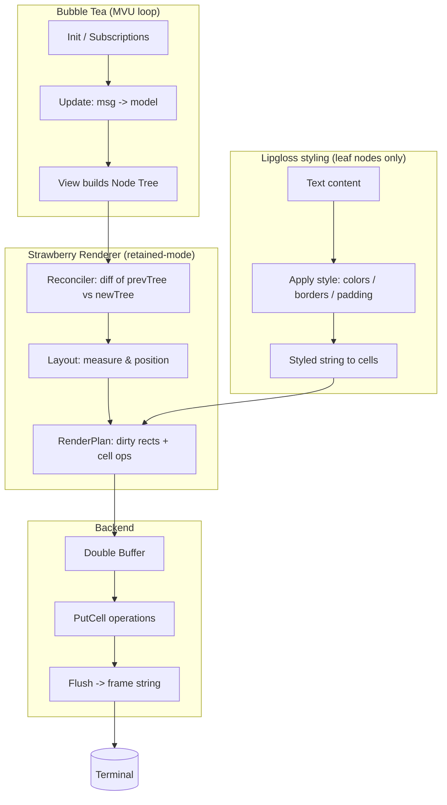
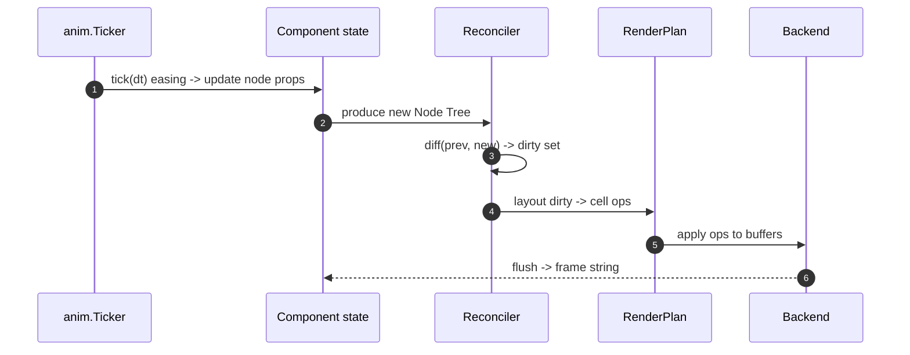

# StrawberryTUI — Retained‑Mode Renderer & Theming Spec (v0.1)

> Goal: keep Bubble Tea’s excellent I/O + MVU loop, add a **retained‑mode renderer** (scene graph, layout, diff/dirty‑rect), and ship a **token‑driven theming system** with Tailwind‑style utility props that accept hex overrides.

---

## 1) Architecture Overview

### 1.1 High‑level flow



### 1.2 Renderer responsibilities

- **Scene graph (Node)**: immutable nodes with IDs, props, style; children form a tree.
- **Reconciler**: computes changes between previous and current trees; marks dirty nodes.
- **Layout engine**: flex‑like layout with constraints; measurement cache.
- **Rasterizer**: converts nodes into **cell ops**; supports clipping, z‑index.
- **Dirty‑rect compositor**: merges changed cells into rectangles; commits minimal writes.
- **Backend abstraction**: ANSI stdout (starter), tcell (future), test backends.

### 1.3 Animation & partial repaint path



---

## 2) Package Layout

```
.
├─ cmd/
│  ├─ tui-cli/
│  └─ tui-playground/
├─ docs/
├─ pkg/
│  ├─ anim/                  # keep as-is
│  ├─ ui/                    # NEW: small public API surface for the renderer
│  │   ├─ node.go            # Node, NodeID, Rect, Attr (re-exported aliases)
│  │   └─ renderer.go        # Renderer interface (constructors wrap internal)
│  └─ theme/                 # keep your current theme package public
│      ├─ tokens.go
│      ├─ theme.go
│      ├─ styles.go
│      └─ motion.go
├─ internal/
│  └─ renderer/              # NEW: retained-mode engine (private)
│      ├─ node.go            # base nodes (Box, Text), Props map
│      ├─ reconcile.go       # diffing, mount/unmount
│      ├─ layout/
│      │   ├─ flex.go        # row/column, grow/shrink/basis, gap, wrap
│      │   └─ measure.go     # text width/graphemes, cache
│      ├─ raster/
│      │   ├─ painter.go     # string→cells, borders, padding
│      │   └─ dirty.go       # dirty-rect packing
│      └─ backend/
│          ├─ ansi.go        # starter ANSI backend
│          └─ tcell.go       # optional high-perf backend
├─ components/
│  ├─ button/
│  ├─ panel/
│  ├─ highlightrow/
│  └─ selectlist/
├─ Makefile
└─ go.mod

```

---

## 3) Public APIs

### 3.1 Node & Renderer (core)

```go
// renderer/node.go
package renderer

type NodeID string

type Node interface {
    ID() NodeID
    Children() []Node
    Props() map[string]any // x,y,w,h, role, data-* like props
}

// Leaf convenience types
type TextNode struct { /* Content string; Style style.Attr; ... */ }

// Renderer orchestrates reconcile -> layout -> raster -> commit
type Renderer interface {
    Reconcile(prev Node, next Node, bounds Rect) RenderPlan
    Commit(RenderPlan) string // returns frame for Bubble Tea View()
}
```

### 3.2 Layout primitives

```go
// layout/flex.go
package layout

type Direction int
const (
    Row Direction = iota
    Column
)

type FlexStyle struct {
    Direction Direction
    Gap       int
    Wrap      bool
}

// Props read on children: grow (int), shrink (int), basis (int)
```

### 3.3 Backend

```go
// backend/backend.go
package backend

type Backend interface {
    Size() (w, h int)
    BeginFrame()
    PutCell(x, y int, r rune, a Attr)
    Flush() string
}
```

---

## 4) Theming & Tokens

**Requirements**

- Provide **default tokens**.
- Allow **hex overrides** at runtime (per theme or per component instance).
- **Utility props** on components (Tailwind‑like) mapped to tokens or raw hex.

### 4.1 Default color tokens (you can tweak later)

```yaml
colors:
  white: "#FFFFFF"
  pink-50: "#FFCAD4"
  pink-60: "#F4ACB7"
  maroon-90: "#3f0d12"
  graphite-90: "#242423"
```

### 4.2 Theme struct & merging

```go
// design/theme/theme.go
package theme

type Color string

type Theme struct {
    Colors map[string]Color // token -> hex
    Spacing map[string]int  // e.g., xs=1, sm=2, md=4, lg=6, xl=8
    Radius  map[string]int  // none=0, sm=0, md=1, lg=2
    Motion  map[string]int  // fast=80ms, normal=160ms, slow=280ms
}

func Default() Theme { /* returns defaults incl. your 5 colors */ }

func Merge(base Theme, overrides Theme) Theme { /* shallow-merge maps */ }
```

### 4.3 Utility props (Tailwind‑style)

- **Syntax**: lightweight strings on component props, e.g. `Class: "bg-pink-50 fg-maroon-90 p-2 px-4 rounded"`.
- **Resolution order**: instance class overrides > component default > theme default.
- **Raw hex support**: `bg-#FF00AA`, `fg-#242423` parsed directly.

Supported utilities (initial):

- Colors: `bg-<token|#hex>`, `fg-<token|#hex>`, `border-<token|#hex>`
- Spacing: `p-<n>`, `px-<n>`, `py-<n>`, `pt-<n>` etc. (n resolves to theme spacing or raw cells)
- Radius: `rounded`, `rounded-sm`, `rounded-lg`
- Text: `bold`, `underline`

### 4.4 Example component API

```go
btn := components.Button(
    id="save",
    label="Save",
    opts: components.ButtonOpts{
        Class: "bg-pink-50 fg-maroon-90 px-4 py-1 rounded bold",
    },
)

// Direct hex override
danger := components.Button("danger", "Delete", components.ButtonOpts{
    Class: "bg-#3f0d12 fg-#FFFFFF px-4 py-1",
})
```

---

## 5) Components (declarative)

Components return **Node trees**; leaves may use Lipgloss to compute styled strings (padding, borders), which are then rasterized to cells.

```go
// components/button/button.go
func Button(id, label string, opts ButtonOpts) renderer.Node {
    // resolve class -> style.Attr using theme
    // build a Box with background + a Text child
}
```

---

## 6) Migration Plan (low risk)

1. **Phase 0 — Interfaces only**

   - Define `Node`, `Renderer`, `Backend` interfaces.
   - Implement a trivial renderer that still renders the whole screen (immediate mode).

2. **Phase 1 — Double buffer + cell ops**

   - Add ANSI backend with double buffer; keep whole‑tree render but via cell ops.

3. **Phase 2 — Dirty‑rects**

   - Maintain `prevBuffer`; compute cell diffs; flush only changed rectangles.

4. **Phase 3 — Layout**

   - Implement flex row/column, grow/shrink/basis, gap, wrap.
   - Add measurement caches for text.

5. **Phase 4 — Theming & utilities**

   - Ship `Theme` with your 5 defaults; implement class parser + token map.
   - Add raw hex parsing in utilities.

6. **Phase 5 — Anim integration**

   - `anim` drives prop changes; reconciler marks nodes dirty; partial repaint.

7. **Phase 6 — Backends**

   - Keep ANSI; add `tcell` with better input/perf.

8. **Phase 7 — Tooling & tests**

   - Golden‑frame tests; perf counters (cells/frame, dirty area percent).

---

## 7) Example: putting it together

```go
model.View = func() string {
  root := layout.VStack("root",
    components.Panel("title", components.PanelOpts{Class: "bg-white fg-maroon-90 p-1"},
      components.Text("t", "StrawberryTUI", components.TextOpts{Class: "bold"}),
    ),
    components.Row("toolbar",
      components.Button("save", "Save", components.ButtonOpts{Class: "bg-pink-50 fg-maroon-90 px-2"}),
      components.Button("del",  "Delete", components.ButtonOpts{Class: "bg-#3f0d12 fg-#FFFFFF px-2"}),
    ),
    components.List(...),
  )
  plan := renderer.Reconcile(prev, root, bounds)
  return renderer.Commit(plan)
}
```

---

## 8) Design tokens — initial defaults

```yaml
colors:
  white: "#FFFFFF"
  pink-50: "#FFCAD4"
  pink-60: "#F4ACB7"
  maroon-90: "#3f0d12"
  graphite-90: "#242423"
spacing:
  xs: 1
  sm: 2
  md: 4
  lg: 6
  xl: 8
radius:
  none: 0
  sm: 0
  md: 1
  lg: 2
motion:
  fast: 80
  normal: 160
  slow: 280
```

Notes:

- You can add derived tokens later (e.g., `surface`, `surface-contrast`, `primary`, `danger`).
- Keep token keys kebab‑case for CLI friendliness.

---

## 9) Utility Class Grammar (draft)

```
Class := (Color | Space | Radius | Text) { Space }*
Color := "bg-" (Token | Hex) | "fg-" (Token | Hex) | "border-" (Token | Hex)
Space := ("p"|"px"|"py"|"pt"|"pr"|"pb"|"pl") "-" Number
Radius := "rounded" ["-sm"|"-lg"]
Text := "bold" | "underline"
Token := [a-z0-9-]+
Hex := "#" [A-Fa-f0-9]{6}
Number := [0-9]+
```

---

## 10) Performance principles

- Rasterize strings into grapheme clusters (use runewidth or custom grapheme iterator).
- Merge adjacent dirty cells into rectangles; cap rectangles per frame.
- Budget: aim <= 3 ms for reconcile+layout+plan on typical views; <= 2 ms commit.
- Add counters: cells written, rect count, frame time; expose in dev overlay.

---

## 11) Should we remake the entire package?

**No full rewrite needed.** Do an **incremental refactor** behind new interfaces:

- Introduce `renderer/` and `design/` packages alongside existing components.
- Adapt each component to return a **Node** instead of a string.
- Keep Bubble Tea programs as‑is; their `View()` simply returns `renderer.Commit(plan)`.
- Migrate gradually: component by component.

---

## 12) Deliverables checklist

- [ ] `renderer` interfaces + ANSI backend stub
- [ ] Flex layout (row/column, grow/shrink/basis, gap)
- [ ] Dirty‑rect compositor
- [ ] Theme defaults with your 5 colors
- [ ] Utility class parser with hex support
- [ ] Button, Panel, Text components ported to nodes
- [ ] `anim` integration demo
- [ ] Golden‑frame tests + perf counters

---

## 13) Quick color preview (ASCII)

```
[ white       ] #FFFFFF
[ pink-50     ] #FFCAD4
[ pink-60     ] #F4ACB7
[ maroon-90   ] #3f0d12
[ graphite-90 ] #242423
```

---

### Appendix A: Minimal Go types (reference)

See the earlier scaffold you have in canvas; lift those files into `renderer/` and `backend/`. Adjust namespacing to match this spec.
